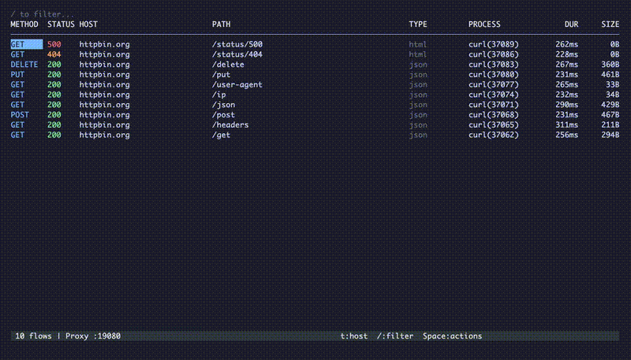

<p align="center">
  
</p>

<p align="center">
  <a href="https://docs.httpmon.dev"></a>
  <a href="https://httpmon.dev"></a>
</p>

<p align="center">
  Terminal-native HTTP/HTTPS debugging proxy. Intercept, inspect, and filter traffic — all from your terminal with vim-style navigation.
</p>

Think Proxyman or Charles, but in your terminal.

<p align="center">
  
</p>

## Features

- **MITM proxy** — Intercept HTTP and HTTPS traffic with auto-generated CA certificates
- **Live flow list** — Watch requests stream in real-time with color-coded methods and status codes
- **Tree view** — Group flows by host, expand/collapse, focus on a single host
- **Detail inspector** — Headers, syntax-highlighted bodies, collapsible sections, image preview
- **Action menu** — Press `Space` for a context-aware command popup — no memorization needed
- **Quick filter** — `/` to filter by host, path, method, status code, or content type
- **HAR export** — Export all flows or a single flow to HAR format
- **Request tools** — Compose new requests, repeat captured ones, copy as cURL
- **Diff view** — Mark two flows and compare request/response side-by-side
- **Host filtering** — Block or allow hosts at the proxy layer with wildcard patterns
- **Scripting** — JavaScript hooks to modify requests/responses on the fly
- **Bandwidth throttling** — Simulate 3G/4G/WiFi network conditions
- **Map Local** — Serve local files instead of upstream responses
- **Protobuf / gRPC-Web** — Decode and display protobuf and gRPC-Web bodies as JSON when `.proto` files are provided
- **Process identification** — See which OS process initiated each request (best with sudo)
- **Persistent settings** — Configure defaults in `~/.httpmon/config.json` or via the TUI settings screen (`P`)
- **Keyboard-driven** — Vim-style navigation throughout — no mouse required

## Quick Start

### Homebrew (macOS/Linux)

```bash
brew install kostyay/tap/httpmon
```

### Install from source

```bash
go install github.com/kostyay/httpmon/cmd/httpmon@latest
```

### Build locally

```bash
git clone https://github.com/kostyay/httpmon.git
cd httpmon
make build
./httpmon
```

### Usage

```bash
httpmon                          # Start proxy on :8080
httpmon --port 9090              # Custom port
httpmon --block "*.ads.com"      # Block hosts matching pattern
httpmon --allow "api.example.*"  # Only intercept matching hosts
httpmon --throttle 3g            # Simulate 3G network (750 kbps)
httpmon --throttle 4g            # Simulate 4G network (4 Mbps)
httpmon --latency 100ms          # Add 100ms latency to responses
httpmon --maplocal rules.json    # Serve local files for matching URLs
httpmon --proto-path ./protos    # Load .proto files for protobuf decoding
httpmon --proto-include ./inc    # Protoc -I style import paths
httpmon --mcp                    # Start with MCP server enabled
httpmon --mcp-token              # Print MCP bearer token
httpmon --install-ca             # Install CA cert into system trust store (needs sudo)
httpmon --version                # Print version
```

Then configure your browser or app to use `http://localhost:8080` as its HTTP proxy.

### Trust the CA certificate

The easiest way — run once with sudo:

```bash
sudo httpmon --install-ca
```

This generates the CA cert (if it doesn't exist yet) and adds it to your system trust store.
Supports macOS and Linux.

<details>
<summary>Manual installation</summary>

**macOS:**

```bash
sudo security add-trusted-cert -d -r trustRoot \
  -k /Library/Keychains/System.keychain ~/.httpmon/mitmproxy-ca-cert.pem
```

**Linux:**

```bash
sudo cp ~/.httpmon/mitmproxy-ca-cert.pem /usr/local/share/ca-certificates/httpmon.crt
sudo update-ca-certificates
```

</details>

## Scripting

Scripts are JavaScript files stored in `~/.httpmon/scripts/`. Each script has a YAML frontmatter header and exports `onRequest` and/or `onResponse` hooks.

### Script format

```javascript
// ---
// name: Add Auth Header
// match:
//   - "*://api.example.com/*"
// enabled: true
// ---

function onRequest(ctx) {
  ctx.headers["Authorization"] = "Bearer my-token";
}

function onResponse(ctx) {
  // ctx.status, ctx.headers, ctx.body
}
```

### Header fields

| Field | Description |
|-------|-------------|
| `name` | Display name (required) |
| `match` | URL patterns to match — `*` wildcards supported (required) |
| `enabled` | `true` or `false` — defaults to `true` if omitted |

### Hooks

**`onRequest(ctx)`** — runs before the request is sent upstream.

| Field | Type | Description |
|-------|------|-------------|
| `ctx.method` | string | HTTP method (read/write) |
| `ctx.url` | string | Full URL (read/write) |
| `ctx.headers` | object | Request headers (read/write) |
| `ctx.body` | string | Request body (read) |
| `ctx.blocked` | bool | Set to `true` to block the request |

**`onResponse(ctx)`** — runs before the response reaches the client.

| Field | Type | Description |
|-------|------|-------------|
| `ctx.status` | int | Status code (read/write) |
| `ctx.headers` | object | Response headers (read/write) |
| `ctx.body` | string | Response body (read) |

### Managing scripts

Press `S` in the TUI to open the scripts manager. From there:

- **Space** — Toggle a script on/off
- **n** — Create a new script from template
- **d** — Delete a script (with confirmation)

Scripts are reloaded each time the manager opens.

## Throttle

Simulate slow network conditions. Throttling applies to all response bodies.

### Presets

| Preset | Bandwidth | Latency |
|--------|-----------|---------|
| `3g` | 750 kbps (93,750 B/s) | 100ms |
| `4g` | 4 Mbps (500,000 B/s) | 50ms |
| `wifi` | 30 Mbps (3,750,000 B/s) | 5ms |

### CLI

```bash
httpmon --throttle 3g             # Apply 3G preset
httpmon --throttle wifi --latency 200ms  # WiFi bandwidth + custom latency
```

### TUI

Press `T` to open the throttle modal. Select a preset with `j`/`k` and press `Enter` to apply. The active preset shows in the status bar.

## Map Local

Serve local files instead of fetching from upstream. Matched requests return the local file's content with the appropriate content type.

### Rules JSON format

```json
[
  {
    "pattern": "api.example.com/config",
    "local_path": "/path/to/config.json",
    "status_code": 200
  },
  {
    "pattern": "*.example.com/styles/*",
    "local_path": "/path/to/override.css"
  }
]
```

`pattern` supports `*` wildcards. `status_code` defaults to 200 if omitted.

### CLI

```bash
httpmon --maplocal rules.json
```

### TUI

Press `M` to open the Map Local manager:

- **n** — Add a new rule (pattern + local path, Tab to switch fields)
- **d** — Delete a rule (with confirmation)
- **Esc** — Close

Changes auto-save back to the rules file.

Flows served from local files show a `[L]` indicator in the flow list.

## Protobuf / gRPC-Web

httpmon can decode protobuf and gRPC-Web response/request bodies into readable JSON when you supply `.proto` files.

```bash
httpmon --proto-path ./protos              # Single dir or file
httpmon --proto-path ./a --proto-path ./b  # Multiple paths
httpmon --proto-include ./vendor           # Import search dirs (like protoc -I)
```

Proto paths persist in `~/.httpmon/config.json`. When a request/response has a matching content type (`application/grpc-web`, `application/grpc-web+proto`, `application/x-protobuf`), the body is automatically decoded and displayed as JSON in the detail view.

## Process Identification

httpmon identifies which OS process originated each proxied request. The **PROCESS** column appears in the flow list, and tree mode (`t`) can group by process instead of host.

Works out of the box; run with `sudo` for full resolution accuracy. Configure tree grouping via the settings screen (`P`) or `~/.httpmon/config.json` (`TreeGroupBy: "process"`).

## Settings

Persistent configuration is stored in `~/.httpmon/config.json` (created on first run). CLI flags override config values for that session.

Press `P` in the TUI to open the settings screen where you can edit:

- Proxy port, buffer size
- MCP enabled/address
- Throttle preset
- List mode (flat/tree), tree group by (host/process)
- Proto paths and import dirs

## MCP Server

httpmon includes an MCP (Model Context Protocol) server so LLM agents can programmatically inspect and debug HTTP traffic.

### Start the MCP server

```bash
httpmon --mcp                        # Start on default addr (127.0.0.1:9551)
httpmon --mcp --mcp-addr :9600       # Custom address
```

### Get the bearer token

```bash
httpmon --mcp-token
```

### Configure Claude Code

```bash
claude mcp add --transport http httpmon http://127.0.0.1:9551/mcp \
  --header "Authorization: Bearer $(httpmon --mcp-token)"
```

### Available tools

| Tool | Description |
|------|-------------|
| `list_requests` | List captured HTTP flows with optional filter |
| `get_request` | Get full request/response details |
| `search_requests` | Search flows by substring |
| `get_request_count` | Count flows matching a filter |
| `export_har` | Export flows as HAR 1.2 JSON |
| `set_throttle` | Set bandwidth throttling (3g/4g/wifi presets) |
| `get_throttle` | Get current throttle settings |
| `replay_request` | Replay a captured request or compose a new one |
| `mock_response` | Mock a response for matching URLs |
| `list_scripts` | List scripting hooks |
| `create_script` | Create a new script |
| `get_script` | Get script source |
| `toggle_script` | Enable/disable a script |
| `delete_script` | Remove a script |

## Keyboard Shortcuts

Press `?` anywhere for the full help overlay, or `Space` for a context-aware action menu.

### Flow List

| Key | Action |
|-----|--------|
| `j` / `k` | Navigate up/down |
| `Enter` | Open flow detail |
| `t` | Toggle flat/tree view |
| `f` | Focus host (tree mode) |
| `l` / `h` | Expand/collapse host (tree mode) |
| `/` | Focus filter bar |
| `Space` | Open action menu |
| `x` | Export HAR |
| `C` | Compose request |
| `d` | Mark for diff |
| `q` | Quit |

### Detail View

| Key | Action |
|-----|--------|
| `1` / `2` | Request/Response tab |
| `j` / `k` | Scroll content |
| `n` / `N` | Next/previous flow |
| `p` | Toggle pretty/raw |
| `e` | Open body in external editor |
| `i` | Toggle image preview |
| `g` / `h` / `b` | Collapse general/headers/body |
| `/` | Search in content |
| `Space` | Open action menu |
| `x` | Export HAR |
| `c` | Copy as cURL |
| `r` | Repeat request |
| `Esc` | Back to list |

### Global

| Key | Action |
|-----|--------|
| `S` | Scripts manager |
| `T` | Throttle settings |
| `M` | Map Local rules |
| `P` | Settings |
| `?` | Help overlay |

## Architecture

```
cmd/httpmon/          CLI entry point, flag parsing, wiring
internal/proxy/       MITM proxy engine (go-mitmproxy wrapper)
internal/store/       Thread-safe ring buffer for captured flows
internal/tui/         Bubble Tea terminal UI (list, detail, menu, compose, diff, export)
internal/filter/      Quick filter + advanced filter expressions
internal/hostfilter/  Wildcard-based host block/allow at proxy layer
internal/har/         HAR 1.2 export
internal/diff/        Flow diff engine
internal/highlight/   Syntax highlighting for response/request bodies
internal/certutil/    CA certificate generation and system trust installation
internal/throttle/    Bandwidth throttling (wraps io.Reader with rate limiting)
internal/maplocal/    Map remote URLs to local files (wildcard pattern matching)
internal/scripting/   JavaScript scripting hooks (goja runtime, YAML frontmatter)
internal/bodydecoder/ Wire format decoding (protobuf, gRPC-Web)
internal/config/      Persistent settings (~/.httpmon/config.json)
internal/procinfo/    Process identification for proxied requests
internal/mcpserver/   MCP server for LLM-driven debugging
```

Built with [go-mitmproxy](https://github.com/lqqyt2423/go-mitmproxy) and [Bubble Tea](https://github.com/charmbracelet/bubbletea).

## Contributing

```bash
make all        # lint + test + build
make test       # tests with race detection
make lint       # golangci-lint
make security   # gosec, govulncheck, gitleaks, trufflehog
```

## License

[MIT](LICENSE)
